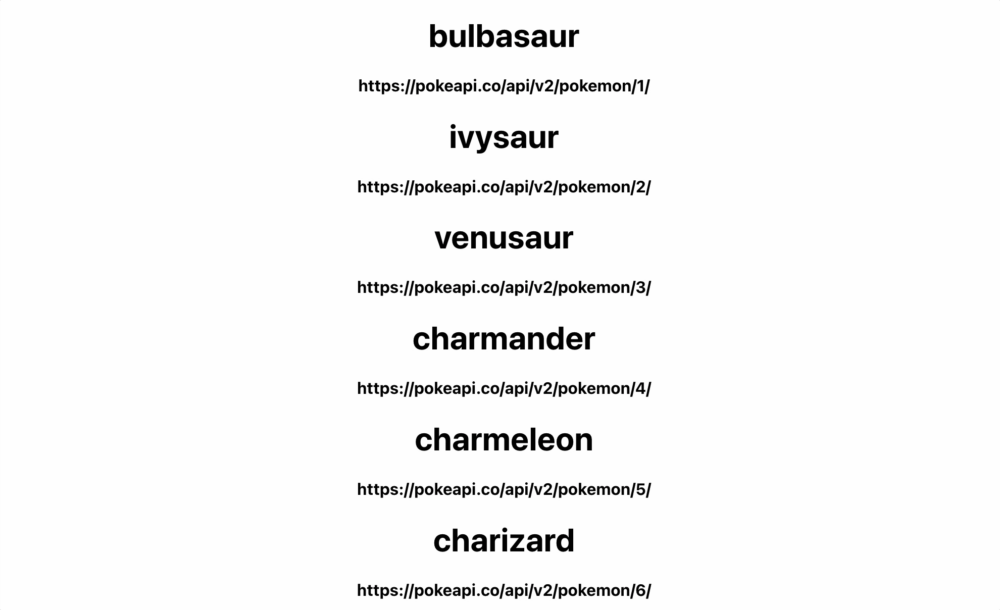

For this practice problem, we want you to display a list of Pokemon and their stats.

# Requirements:

- Pokemon load from https://pokeapi.co/api/v2/pokemon and are listed on the page
- The page displays the name of the Pokemon and its API URL
- When a URL is clicked, the Pokemon’s stats are fetched from `https://pokeapi.co/api/v2/pokemon/${name}`
- The page displays the stat name and base stat for all stats below its Pokemon

# Tips:

## The list of Pokemon has this structure:

```
{
	count: 1154
	next:"https://pokeapi.co/api/v2/pokemon/?offset=20&limit=20"
	previous:null
	results: [
		{
			name:"bulbasaur"
			url:"https://pokeapi.co/api/v2/pokemon/1/"
		},
		{
			name:"ivysaur"
			url:"https://pokeapi.co/api/v2/pokemon/2/"
		},
		etc…
	]
}
```

Pokemon should be listed on the page with their name and URL.

There will only be 20 Pokemon listed.

Each Pokemon has 6 stats.

## Individual Pokemon have this structure:
(unnecessary items were shortened)

```
{
    abilities: [],
    base_experience: 64,
    forms: [],
    game_indices: [],
    height: 7,
    held_items: [],
    id: 1,
    is_default: true,
    location_area_encounters: "",
    moves: [],
    name: "bulbasaur" ,
    order: 1,
    past_types: [],
    species: {},
    sprites: {},
    stats: [
        {
            base_stat: 45,
            effort: 0,
            stat: {
                name: "hp",
                url: "https://pokeapi.co/api/v2/stat/1/"
            }
        },
        {
            base_stat: 49,
            effort: 0,
            stat: {
                name: "attack",
                url: "https://pokeapi.co/api/v2/stat/2/"
            }
        },
        etc…
    ],
    types: [],
    weight: 69
}
```

A Pokemon’s stats should only show after the Pokemon’s API URL has been clicked.

All information can be displayed on the same page.

It’s not necessary to use an AbortController.
